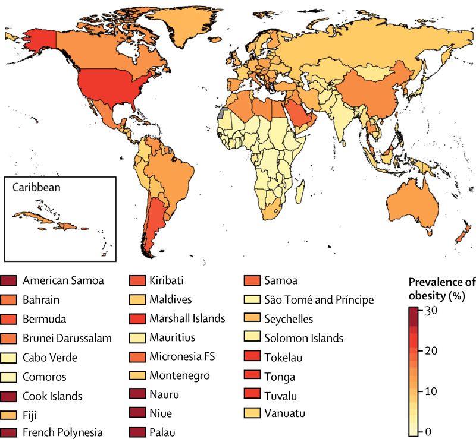

<!-- Section -->
<section>
	<header class="major">
		<h2>Why teenagers?</h2>
	</header>
	

		<article>
			
			

				<h3>Age</h3>
				
Teenagers are at the age where their metabolism is fast. It would be easier to lose weight now and maintain your desired weight, than losing weight later in life. 

			

		</article>
		<article>
			
			

				<h3>Educate</h3>
				
Many teenages eat junk food because it is easy to grab, tastes good, and keeps you satisfied until the school day is over. Showing them the effects of this could help their health in the long run. 

			

		</article>
		<article>
			
			

				<h3>Sleep</h3>
				
Because of early mornings and sports teams, students often lack the recommended hours needed for the body to function. They go to school exhausted or buy coffee in the morning which can lead to detrimental consequences.

			

		</article>
		<article>
			
			

				<h3>Exercise</h3>
				
Nowadays, people are becoming more and more aware of exercising, especially students. They might stay active so they could feel like they are good in their new clothes, but they might not know the real benefits for staying fit. 

			

		</article>
	

</section>

<!-- Section -->
<section>
	<header class="major">
		<h2>Statistics</h2>
	</header>
	

		<article>
			
			<h3>Obesity Prevalence In Boys (2016)</h3>
			
The rise of obesity worldwide gives us a warning sign; showing us that even in the poorest countries it is still growing. With the lack of policies targeting unhealthy food and enforcing quality healthcare, can make obesity worse.
			

			<ul class="actions">
				<li><a href="https://www.npr.org/sections/thetwo-way/2017/10/11/557093908/obesity-in-children-and-teens-rose-sharply-worldwide-over-past-4-decades" class="button">More</a></li>
			</ul>
		</article>
		<article>

			
			<h3>Number of Deaths by Risk Factor, World, 201</h3>
			
The chart shows obesity as one of the top five causes of death by risk factors. Even though it's not the main cause of death, a majority of health problems come from obesity, like high blood pressure. Which caused the death of 10.4 million.
			

			<ul class="actions">
				<li><a href="https://ourworldindata.org/obesity" class="button">More</a></li>
			</ul>
		</article>
		<article>
			
			<h3>Sleep VS BMI</h3>
			
The study compares the body mass index of medical students to the number of hours they slept per night. The result of this experiment was short-sleep duration was significantly associated with the increase risk of being overweight and obese.
			

			<ul class="actions">
				<li><a href="https://www.researchgate.net/figure/The-relationship-between-fewer-hours-of-sleep-per-day-and-the-incidence-of-high-body-mass_fig1_313374915" class="button">More</a></li>
			</ul>
		</article>
		<article>
			
			<h3>Sleep Duration with Obesity & Cardiometabolic Risk Factor</h3>
			
This study was conceived from children and adolescents. In simple words, this chart shows how frequent obesity and sleep correlate. When boys and girls sleep the recommended hours, they has a lower chance of getting obese. However when the boys and girl sleep less or more then the recommended hours, they have a higher chance of getting obese. 

			<ul class="actions">
				<li><a href="https://www.nature.com/articles/s41598-019-45951-0#Fig1" class="button">More</a></li>
			</ul>
		</article>
		<article>
			
			<h3>Americans are sleeping less than they use to</h3>
			
This Gallup data displays a massive change in sleep between 1942's and 1990's. Throughout the last couple of decades, people are not getting the recommended hours each night. 

			<ul class="actions">
				<li><a href="https://www.vox.com/2014/6/12/5801168/maps-of-the-sleep-epidemic" class="button">More</a></li>
			</ul>
		</article>
		<article>
			
			<h3>Lack of sleep VS Concentration</h3>
			
In this CDC analysis, it portrays people struggling to accomplish everyday task when they don’t sleep the recommended hours. /  

			<ul class="actions">
				<li><a href="https://www.vox.com/2014/6/12/5801168/maps-of-the-sleep-epidemic" class="button">More</a></li>
			</ul>
		</article>
	

</section>
